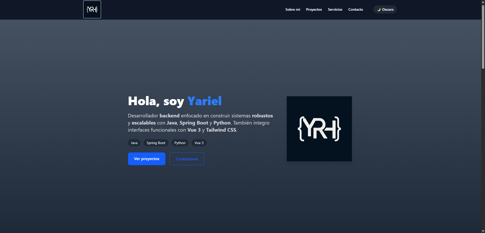
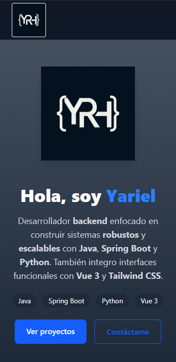

# 🌐 Portafolio de Yariel

¡Hola! Soy **Yariel**, un desarrollador **backend** especializado en construir soluciones robustas, escalables y modernas usando tecnologías como **Java**, **Spring Boot** y **Python**. Este portafolio es una muestra de mi trabajo, estilo de desarrollo y proyectos personales.

---

## 🚀 Sitio Web
https://yrobainah.github.io/portfolio-yariel/

---

## 🛠️ Tecnologías utilizadas

- **Vue 3** – Framework frontend progresivo
- **Tailwind CSS** – Utilidades para estilizado moderno y responsivo
- **Vite** – Herramienta de construcción ultrarrápida
- **Java + Spring Boot** – Backend en proyectos destacados
- **GitHub Pages** – Hosting estático para este portafolio

---

## 🧩 Estructura del portafolio

- **Hero**: Presentación profesional
- **Sobre mí**: Perfil y tecnologías dominadas
- **Proyectos**: Selección de mis trabajos con enfoque backend
- **Servicios**: Qué ofrezco como desarrollador
- **Contacto**: Cómo puedes comunicarte conmigo
- **Modo oscuro**: Experiencia visual adaptable al usuario

---

## 📷 Capturas del portafolio

| Desktop | Móvil |
|---------|-------|
|  |  |

---

## 📩 Contacto

Si estás interesado en colaborar o contratarme para tu próximo proyecto, no dudes en contactarme.

- ✉️ [Correo electrónico](mailto:yrobaina95@email.com)
- 💼 [LinkedIn](https://linkedin.com/in/yariel-robaina-hernández-39512b1a9/)
- 💻 [GitHub](https://github.com/Yrobainah)

---

## 📦 Instalación local (opcional)

```bash
git clone https://github.com/tuusuario/tu-repo.git
cd tu-repo
npm install
npm run dev
